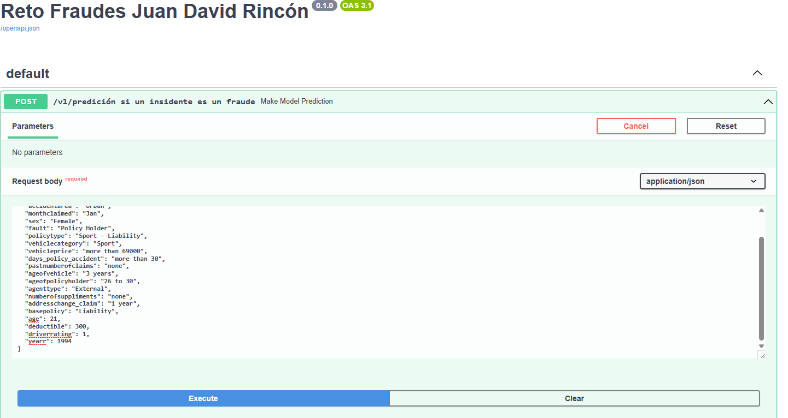
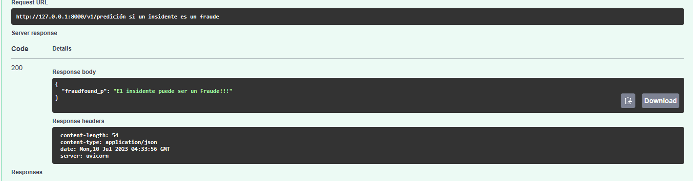

# Fraudes en reclamaciones a sinistros

### Este repositorio contiene la solución a la prueba de selección para [DATA SCIENTIST en  R5](https://bitbucket.org/wilmards/r5-ds-challenge/src/master/)

- La solución de los puntos del 1 al 4 se en encientran en `\input\problema_posgres.sql` y su explicación se encuentra en el
notebook de trabajo `\fradues\notebook\notebook.ipynb`
- La solución del punto 5 es un tablero realizado en Power BI [aqui](https://app.powerbi.com/view?r=eyJrIjoiNTdkYTJiMGYtZjBlNS00ZTIwLWIzNWItNTk5YTZlZTM3YTJmIiwidCI6Ijk5ZTFlNzIxLTcxODQtNDk4ZS04YWZmLWIyYWQ0ZTUzYzFjMiIsImMiOjR9)
el cual tambien se encuentra en la raiz de este repositorio `tablero_fraudes.pbix`

- El punto 6

#!!! **Extra:** este repositorio se realizó con el objetivo de emular el desarrollo de un proyecto real, siguiendo
los lineamientos de la información que se encuentra en la rama de master, para su instalación y funcionamiento
se debe seguir los siguientes pasos:
- Clonar el repositorio
```git https://github.com/jdrincone/fraudes.git```
- Crear un entorno virtual e installar los requerimientos
```pip install -r requeriments.txt```
- Actualizar el modelo
```$ python actualizar_modelo.py```
- Levantar la api
```uvicorn app_fraudes:app```
**En lo los anteriores pasos se ha realizado**

- Estructura de repositorio siguiendo las buenas practicas de desarrollo y siguiento los convensional commits.
- Aplicación reglas del PEP8 para tener un código a lo pytonista.
- Scripts para procesamiento y entrenamientos los cuales se encuentran en el modulo de `src`
- Dado que no es debido subir a los repositorios la fuente de datos y menos credenciales de Bases de datos o
  fuentes de almacenamiento como el S3, en este caso, se toma los datos iniciales desde ruta en el S3 que temporalemte
  estará abierta.
- Creación script principal para actualizar modelo de clasificación.
- Creación API que dado las parámetros de una reclamación se indica si esta es un fraude o no, dentro de lo
  que el modelo lo permite.





